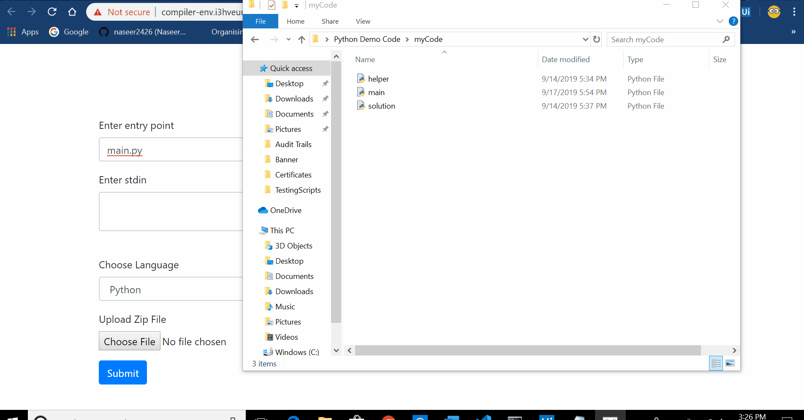

# Compiler REST API

## What is this?

This API can compile and run code with stdin and send a response with stdout. It can compiler java, C, C++ and python. Try it out [here](https://naseer-compiler-api.herokuapp.com/). 

#### Demo Page


## How to use the Demo Page?

Click [here](http://compiler-env.i3hveummcp.ap-southeast-1.elasticbeanstalk.com/) to access the demo page.

|   Field    |                                                                                                                      Explanation                                                                                                                       |
| :--------: | :----------------------------------------------------------------------------------------------------------------------------------------------------------------------------------------------------------------------------------------------------: |
| entrypoint |                                                                                         This is the name of the file that you want to run. For example main.py                                                                                         |
|   stdin    |                                                              This is the standard input that is set before running the program. Standard input is the way you pass data into the program.                                                              |
|  language  |                                                                                           This compiler supports 4 Languages. Choose one using the selector                                                                                            |
|  zip file  | This is the zip a <b>folder of all the files that conatin your code</b>.<i>It is very important that your folder name and zip name are <b>exactly the same (should not contain spaces)</b></i>. Note that one of these files should be your entrypoint |



## Making an API call

In order to make an API call to this compiler, you will first need a form of the following structure

```HTML
<form enctype="multipart/form-data" onsubmit="handle();" id="myForm">
    <div class="entrypoint">
        <label for="entrypoint">Enter entry point</label>
        <input type="text" name="entrypoint"/>
    </div>

    <div class="input_text">
        <label for="input_text">Enter stdin</label>
        <textarea type="text" name="input_text"></textarea>
    </div>

    <div class="language">
        <label for="language">Choose Language</label>
        <select name="language">
            <option value="python">Python</option>
            <option value="C">C</option>
            <option value="C++">C++</option>
            <option value="java">Java</option>
        </select>
    </div>

    <div class="myCode">
        <label for="myCode">Upload Zip File</label>
        <input type="file" name="myCode"/>
    </div>

    <button type="submit">Submit</button>
</form>
```

Next you will need to write JavaScript to make the API call.

```javascript
function handle() {
  var myForm = document.getElementById("myForm");
  var formData = new FormData(myForm);
  var url =
    "http://compiler-env.i3hveummcp.ap-southeast-1.elasticbeanstalk.com/";
  var options = {
    method: "POST",
    body: formData
  };
  fetch(url, options)
    .then(res => res.json())
    .then(json => {
      console.log(json);
      //Do whatever you want with this JSON response
    });
}
```

### Response

If everything works out perfectly, you will recieve a response of the following structure

```JSON
{
    "stdout":"A string that will contain the standard output of the code",
    "timeTaken": "An integer that will represent time taken to run this code in milliseconds",
    "memory":"A string that will contain the total memory used by the code."
}
```

Example output

```JSON
{
    "stdout":"Hello World\n",
    "timeTaken":1443,
    "memory":"1.126 MB"
}
```

If there is an error, the API will send back the following resonse

```JSON
{
    "error":"A string that describes the error"
}
```

Example output (This was a python code that had prin("Hello World"))

```JSON
{"error":"Command failed: valgrind --tool=massif python3 data/myCode/main.py\n==51== Massif, a heap profiler\n==51== Copyright (C) 2003-2017, and GNU GPL'd, by Nicholas Nethercote\n==51== Using Valgrind-3.13.0 and LibVEX; rerun with -h for copyright info\n==51== Command: python3 data/myCode/main.py\n==51== \nTraceback (most recent call last):\n  File \"data/myCode/main.py\", line 4, in <module>\n    prin(\"Hello world\")\nNameError: name 'prin' is not defined\n==51== \n"}
```
